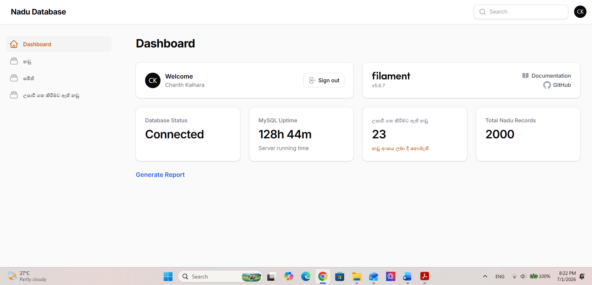
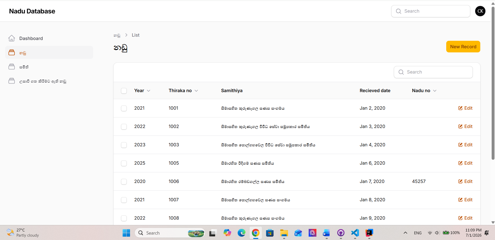
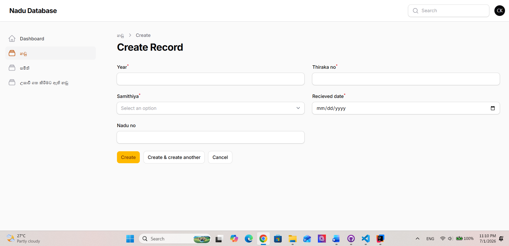
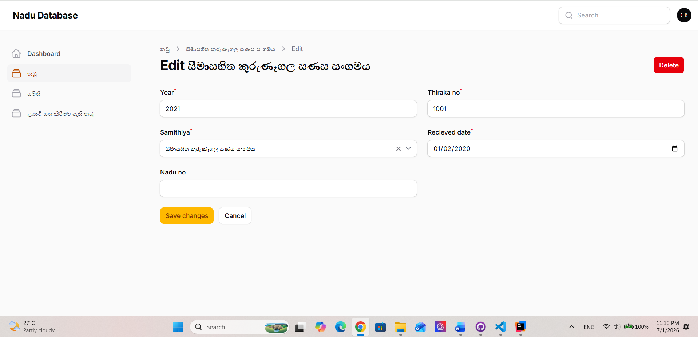
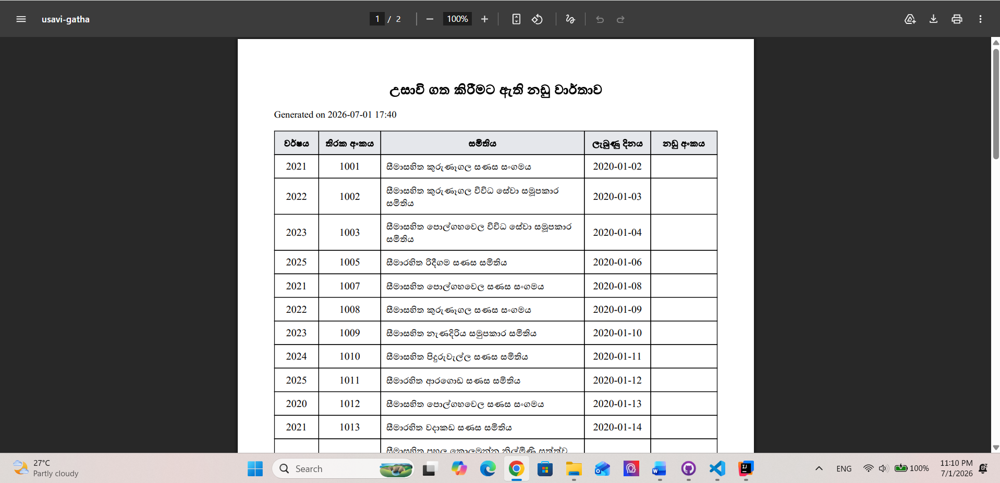

# Nadu V2 - Cloud-Based Court Case Management System

## Overview

Nadu V2 is a modern web-based Court Case Management System developed to digitize and streamline the management of debt recovery court records. The system enables authorized users to create, search, update, and manage court case information through an intuitive dashboard while generating printable PDF reports.

Built using Laravel and Filament, the application provides a secure, scalable, and maintainable solution for government and organizational use.

---

## Features

- Dashboard with real-time database statistics
- Court case record management (Create, Read, Update, Delete)
- Fast search and filtering
- PDF report generation
- Secure authentication
- Responsive administration dashboard
- MySQL database integration
- Sinhala language support
- Form validation and error handling

---

## Screenshots

### Dashboard



### Court Records



### Create Record



### Edit Record



### PDF Report



---

## Technology Stack

- Laravel
- PHP
- Filament
- MySQL
- Blade
- Tailwind CSS
- Vite
- Composer
- Git
- GitHub

---

## Project Structure

```
Laravel
│
├── Authentication
├── Dashboard
├── Court Record Management
├── PDF Report Generation
├── Database
└── Administration Panel
```

---

## Key Functionalities

- User authentication
- Dashboard overview
- Create new court records
- Edit existing records
- Delete records
- Search court records
- Generate printable PDF reports
- Database monitoring

---

## Future Improvements

- Role-Based Access Control (RBAC)
- Audit logs
- Backup and recovery
- Advanced analytics dashboard
- Email notifications
- Cloud deployment
- REST API
- Docker support
- CI/CD pipeline

---

## Installation

```bash
git clone https://github.com/CharithKalhara/Nadu-V2.git

cd Nadu-V2

composer install

cp .env.example .env

php artisan key:generate

php artisan migrate --seed

npm install

npm run build

php artisan serve
```

---

## Author

**Charith Kalhara**

Computer Science Undergraduate

GitHub:
https://github.com/CharithKalhara

LinkedIn:
https://linkedin.com/in/charithkalhara

---

## License

This project is developed for educational and portfolio purposes.
